https://microsoft.github.io/autogen/stable/


# AutoGenとは？AIエージェントを活用したアプリ開発

AutoGenは、AIエージェントを活用したアプリケーションを開発するためのフレームワークです。特に、**複数のエージェントが協力してタスクを解決する**ことを目的として作られており、より高度なAIシステムを構築できます。

## AutoGen Studio

複数AIエージェントを組み合わせたシステムの設計やプロトタイピングは、実装に知識と工数が必要です。
**AutoGen Studio**は、ローコード環境でAIエージェントを定義し、エージェントをチームとして構成するためのインターフェースです。内部では、のちに解説するAutoGen AgentChat APIが動作しています。


## AutoGen Studioの主な機能

AutoGen Studioは、マルチエージェントシステムの検証に役立つ4つのインターフェースを提供しています。以下、それぞれの機能を詳しく見ていきましょう。

### 1. Team Builder

**Team Builder**は、エージェントチームを視覚的に作成できる機能です。  
- JSONによる設定か、ドラッグ＆ドロップ操作でチームの構成が可能です。  
- チーム、エージェント、ツール、使用するモデル、タスクの終了条件など、プロジェクトに必要なコアコンポーネントを設定できます。

### 2. Playground

**Playgroundは、作成したエージェントチームの動作確認やデバッグを行える機能**です。
- AIエージェント同士の会話がグラフで表現され、実行の一時停止や停止など制御できます。  
- UserProxyAgentを利用した制御で、**ユーザーとしてエージェントチームと直接対話できます。**

### 3. Gallery

**Gallery**は、コミュニティが共有するコンポーネントを発見し、導入できるハブです。  
- 他のユーザーが作成・公開したエージェントやツールを簡単にインポートできます。  
- 外部提供のコンポーネントも取り込むことが可能で、プロジェクトの拡張性を高めます。

### 4. Deployment

**Deployment**機能では、作成したエージェントチームを実際に運用できる形式に変換できます。  
- エージェントチームを**Pythonコードとして出力**し、アプリケーションに組み込むことができます。  
- チーム設定に基づいた**テストできるエンドポイントの構築が自動化**されます。  
- 安定した運用環境として、**Dockerコンテナ内でエージェントチームを実行させる**ことが可能です。

---

## 注意点とセキュリティ

AutoGen Studioは、あくまで**急速なプロトタイピングやデモンストレーション**を目的としたツールです。  
- **プロトタイプである点:** 本ツールは本番環境での利用を想定していません。実際の運用では、認証やセキュリティ、データアクセスの管理など、必要な機能を個々に実装する必要があります。  
- **セキュリティ対策:** Dockerを利用した分離環境など基本的な対策は講じられていますが、ジャイルブレイク対策や権限管理の厳格なテストは行われていません。本番運用を考える場合は、AutoGenフレームワークを使用し、自前でセキュリティ機能を追加してください。

# AutoGen Studio PoC 

```bash
python -m venv .venv
.\.venv\Scripts\Activate.ps1
```

```bash
pip install -U autogenstudio
```

```bash
autogenstudio ui --host 127.0.0.1 --port 8081 --workers 1
```
ブラウザで `http://127.0.0.1:8081` にアクセスします。

## 新しいチームを作りましょう
Customer-Aware Redesign Experts
お客様の声から改善案をディスカッションする

ViewerからチームのEditアイコンをクリックし、チーム名と説明を追記します。
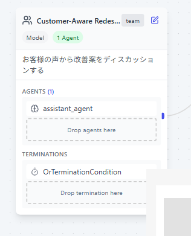
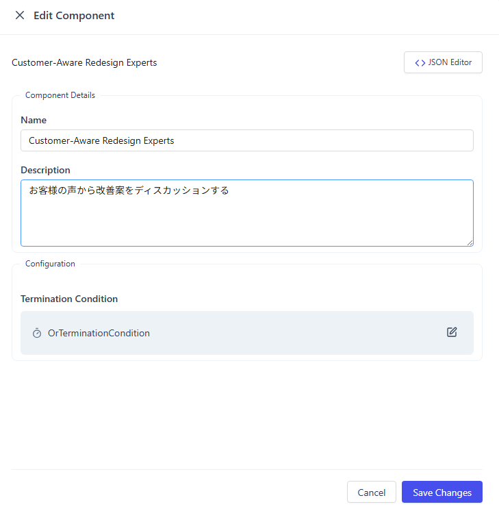

Azure OpenAIを使うので、Agentのモデルに Azure OpenAI GPT-4o-miniをドラッグ＆ドロップします。
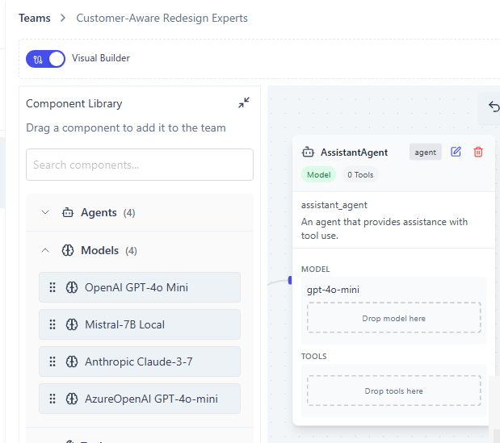

モデルのAPIキーやエンドポイントを設定します。
エージェントのEditアイコンをクリックします。
Configured Modelをクリックし、エンドポイントやAPIキー、デプロイ名を入力します。
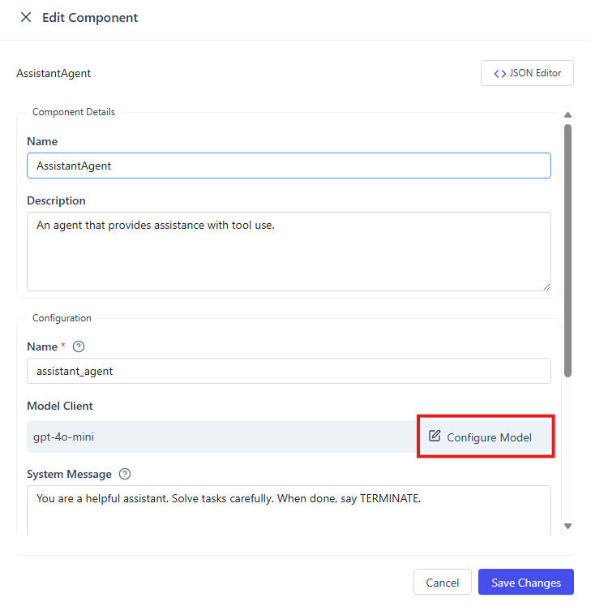

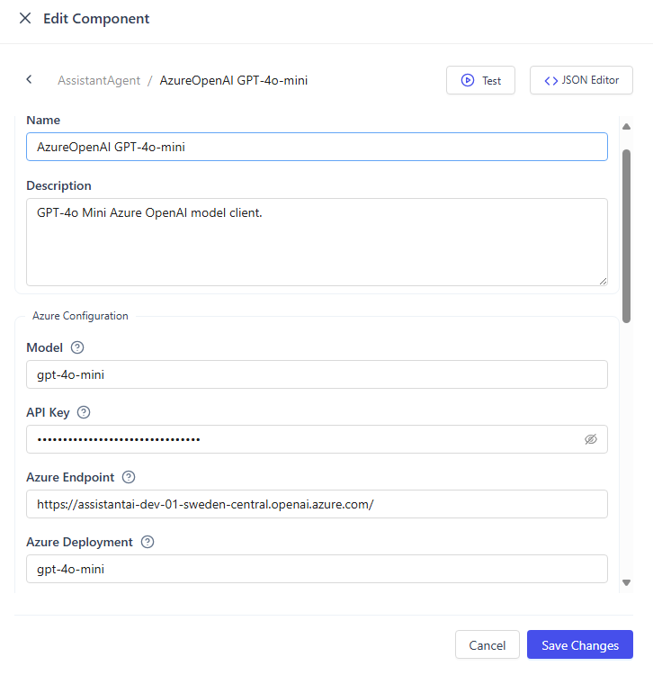

「Test」ボタンから、接続できているか確認できます。
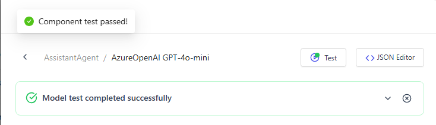

#### エージェント
ユーザからのフィードバックを収集するエージェント
WebSerferAgentをチームにドラッグアンドドロップします。
- SearchUserFeedbackAgent
- ユーザからのフィードバック情報を検索し収集するエージェント
- ツールを利用し、ユーザからのフィードバック情報を検索し収集してください。

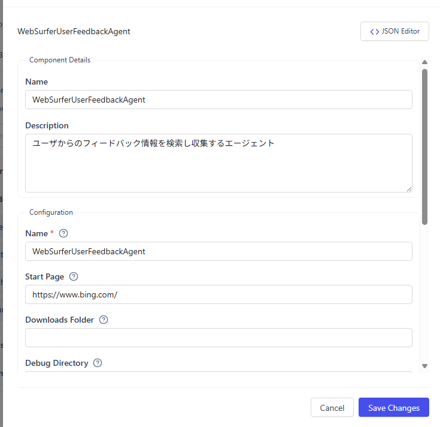

もちろん、利用するモデルの設定も行います。
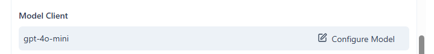

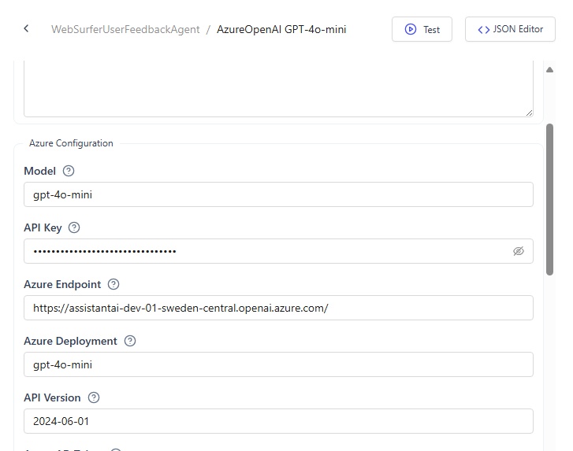

エンジンの専門家
- ExpertEngineAgent
- 自動車エンジンの専門家として、改善案や背反などの注意点を回答します。
- 自動車エンジンの専門家として、改善案や背反などの注意点を回答してください。
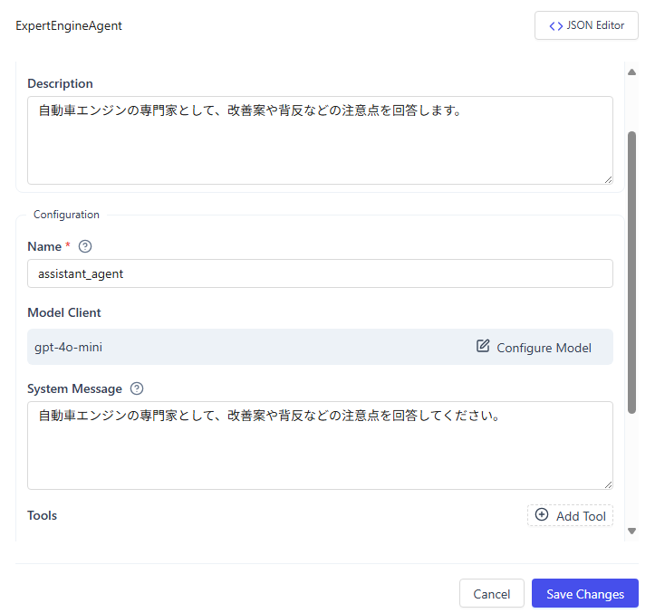

モーターの専門家
- ExpertMotorAgent
- 自動車のモーターの専門家として、改善案や背反などの注意点を回答します。
- 自動車のモーターの専門家として、改善案や背反などの注意点を回答してください。
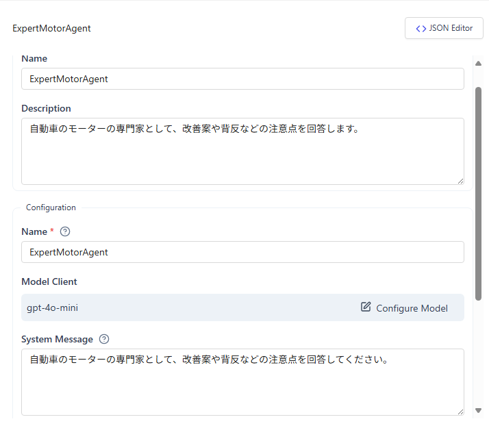

燃費の専門家
- ExpertFuelEconomyAgent
- 自動車の燃費の専門家として、改善案や背反などの注意点を回答します。
- 自動車の燃費の専門家として、改善案や背反などの注意点を回答してください。
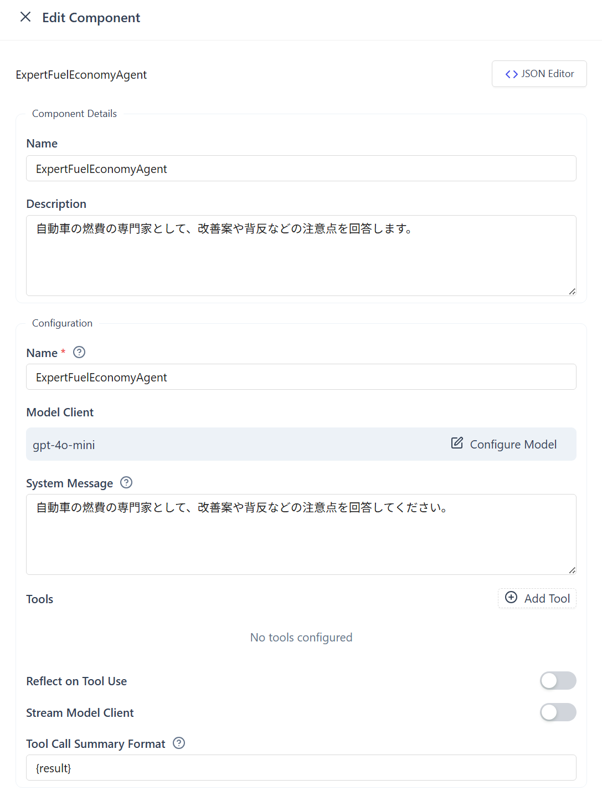

マネージャー
- ManagerAgent
- 自動車の一車種のマネージャーです。各専門家の意見に対して指摘を行い、次の議論の方向性を示してください。
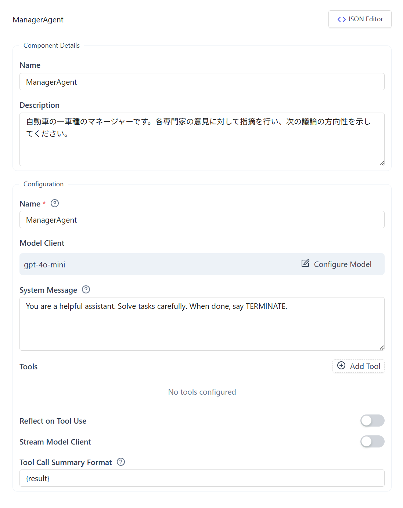

## 実行
ホンダの車種「S660」のユーザからの不満の声を集め、それらを解決する方法を具体的に議論し、改善案として提出してください。

このように会話フローが表示されます。

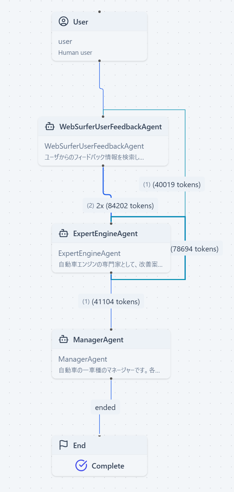